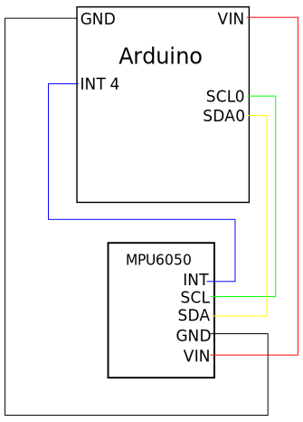

# gyroscopic view  
Affiche une vue openGL simple représentant l'orientation du gyroscope en tant réell

## Branchement de la carte Arduino au MPU_6050

## Calibrage du MPU_6050 ##

### Compilation et upload du programme de calibrage
~~~{.sh}
cd src/mpu6050/
make
cd build/MPU6050_Calibration/
make calibration-upload
~~~

Pensez à appuyer sur le bouton de votre arduino après le "make upload" pour bien uploader le programme

### Execution du programme de calibrage
Connectez vous au port série de la teensy pour qu'elle se calibre
Avant le calibrage vérifiez que le MPU6050 est bien à plat et ne touchez plus à la table

~~~{.sh}
cu -l /dev/ttyACM0 -s 9600
~~~
La calibration peut prendre un peu de temps.
une fois la calibration terminée reportez les valeurs dans le programme MPU6050_DOF

### Modification de l'offset dans MPU6050_DMP6
Modifier le fichier "MPU6050_DMP6/MPU6050_DMP6.ino" avec les valeurs suivantes qui se trouvent environ ligne 200
~~~{.cpp}
mpu.setXGyroOffset(27);                                                                                      
mpu.setYGyroOffset(7);
mpu.setZGyroOffset(2);
mpu.setZAccelOffset(1340); // 1688 factory default for my test chip
~~

## Compilation et Upload du programme pour récupérer les angles d'eulers
~~~{.sh}
cd src/mpu6050
make
cd build/MPU6050_DMP6/
make mpu6050-upload
~~~

Pensez à appuyer sur le bouton de votre arduino après le "make upload" pour bien uploader le programme

## Compilation et lancement l'affichage gyroscopic

~~~{.sh}
cd src/gyroscopicView
make
cd build/
./gyroscopicView
~~~

